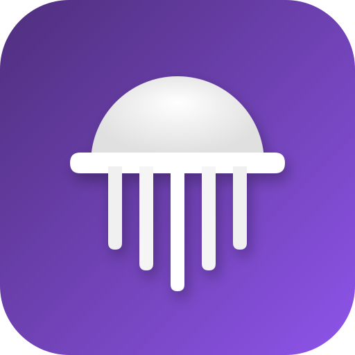
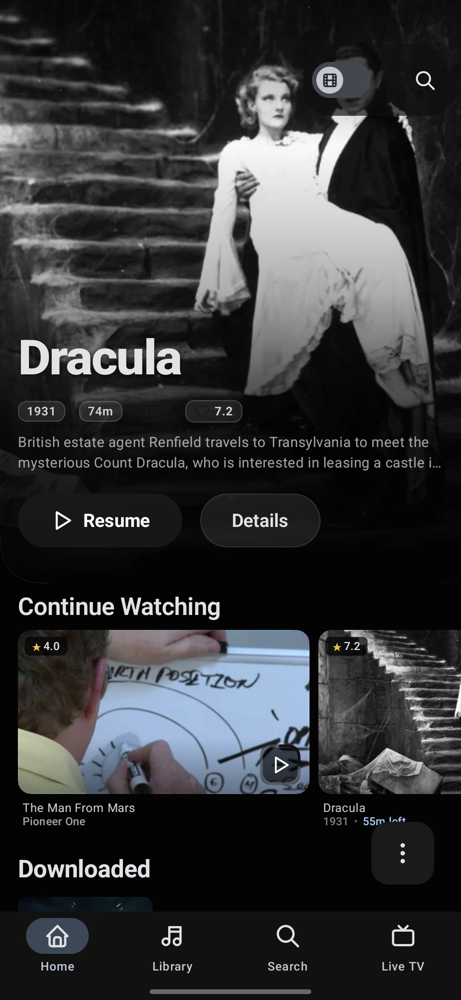
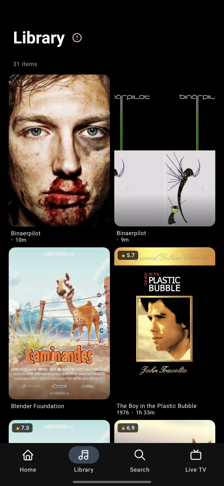
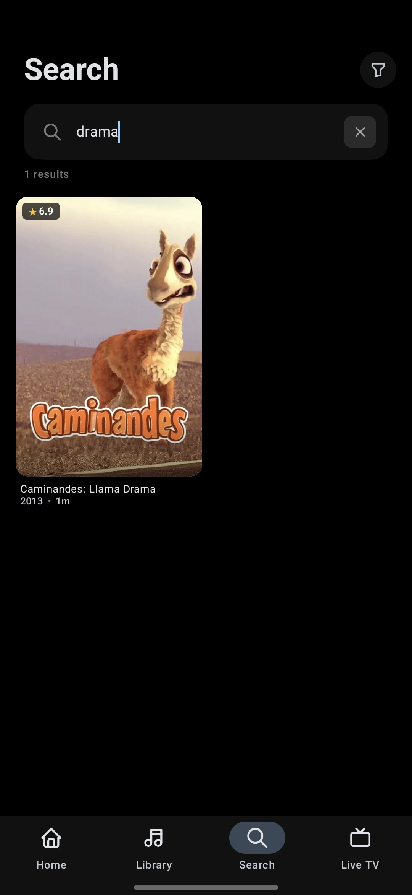
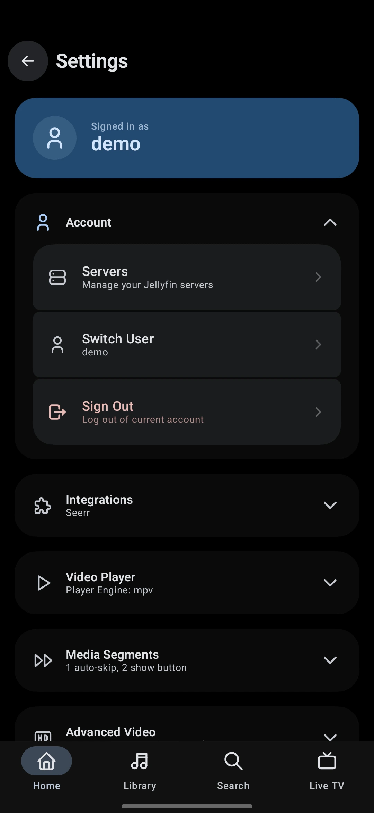
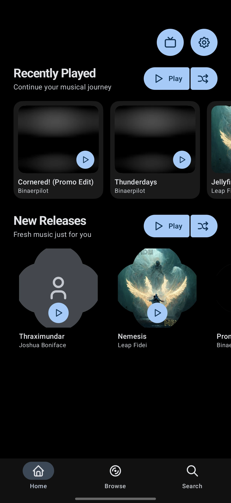
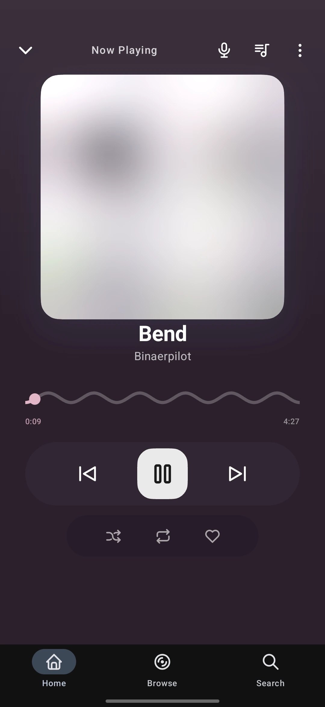
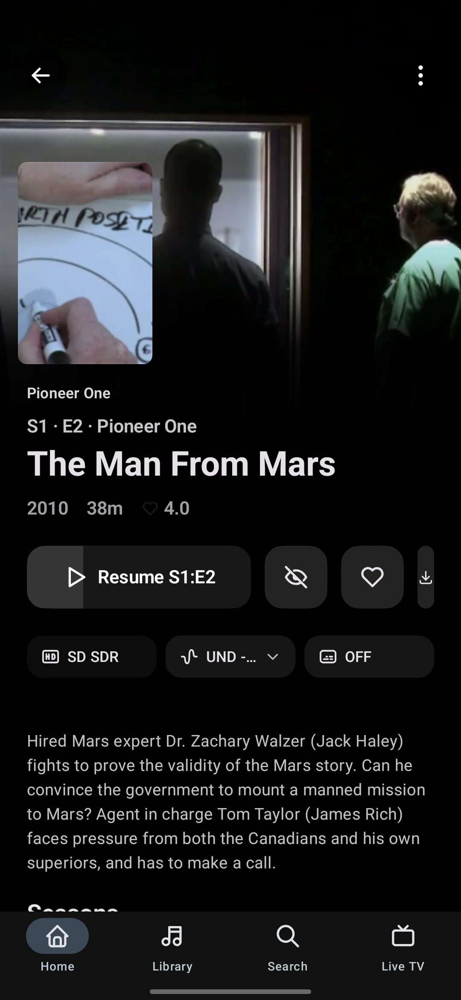
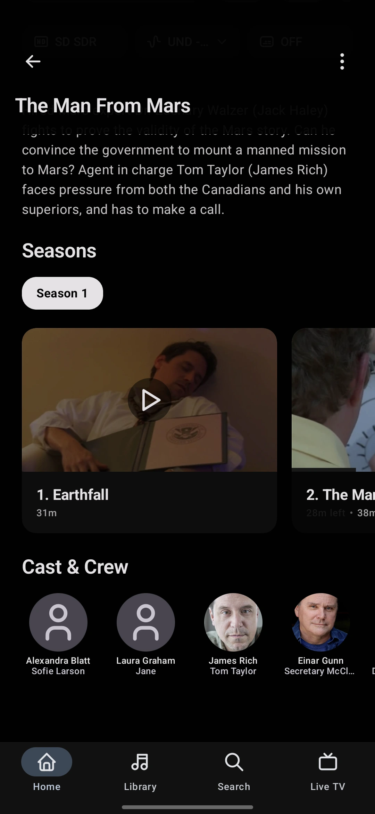
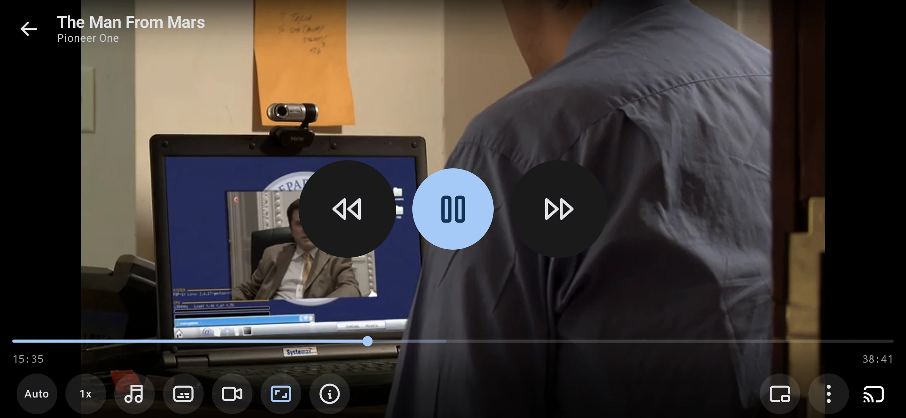

<div align="center">

# JellyPlay

</div>

<p align="center">
	
</p>

<p align="center">
	
	
	
	
	
	
	
</p>

<p align="center">
	<sub>Native Jellyfin client for Android, Android TV & Fire TV &nbsp;&middot;&nbsp; Material 3 Expressive &nbsp;&middot;&nbsp; ExoPlayer, libmpv & LibVLC &nbsp;&middot;&nbsp; Self-hosted, no tracking</sub>
</p>

<div align="center">

### Modern, open-source Jellyfin client for Android, Android TV & Fire TV

**JellyPlay** is a native, high-performance **Jellyfin client for Android** — built from scratch in **Kotlin** and **Jetpack Compose** with **Material 3 Expressive**. No web wrapper, no Cordova, no embedded browser.

One app for every screen: **phones, tablets, foldables, Android TV, and Amazon Fire TV**. Stream movies and shows, play music with synced lyrics, request content via **Jellyseerr/Overseerr**, manage your **Radarr/Sonarr** queues, download for offline, and run your server from a built-in **admin dashboard** — with three switchable video engines (**ExoPlayer, libmpv, LibVLC**), in-app **self-update** via GitHub Releases, no accounts, and no tracking.

If you self-host Jellyfin and want a truly native, beautiful, capable client — or a **Plex/Kodi alternative** — give JellyPlay a try.

[Highlights](#highlights) • [Why JellyPlay?](#why-jellyplay) • [Features](#features) • [Tech Stack](#tech-stack) • [Requirements](#requirements) • [Building](#building) • [Permissions](#permissions) • [Project Structure](#project-structure) • [Docs](./docs) • [Website](https://raulshma.github.io/jellyplay/)

</div>

## Highlights

| | |
| :--- | :--- |
| 🎬 **Multi-engine video player** | Switch between **ExoPlayer (Media3)**, **libmpv**, and **LibVLC** per device — HDR, refresh rate/resolution matching, trickplay seeking, A/B repeat, gestures, Chromecast, and Picture-in-Picture. |
| 💬 **Full subtitle system** | **ASS/SSA** & **VTT** parsing, external subtitle loading & download, full styling, delay offset, **live sync preview** with cue stack & ±30 s offset slider, **multi-provider search** (Jellyfin, Wyzie, OpenSubtitles), **per-series role memory**, and consistent track labels & badges across engines. |
| 📱 **Native on every screen** | Phone, tablet, foldable, **Android TV**, and **Fire TV** with D-pad navigation, a Leanback launcher, and adaptive Material 3 layouts. |
| 🎵 **Rich audio player** | Synced lyrics via LRCLIB, 10-band equalizer, Night Mode & Dialogue Boost, ambient visualizer, mood playlists, and gapless playback. |
| ⬇️ **Offline downloads** | Download movies and series with HTTP Range resumption, background workers, and a dedicated offline library for travel. |
| 📡 **Seerr + Arr integration** | Discover and request via **Jellyseerr/Overseerr**, manage **Radarr/Sonarr** queues, and track an upcoming-releases calendar — all in-app. |
| 👯 **SyncPlay & Play On** | Real-time watch parties with speed/skip-to-sync correction and in-player chat, plus cast-to and control other Jellyfin sessions. |
| 🛠️ **Server admin dashboard** | System health, active sessions, scheduled tasks, server logs, user stats, and stale-media cleanup — without leaving the app. |
| 📺 **Live TV & DVR** | Browse live channels, an Electronic Program Guide, **delivery-method selection** (Auto / Direct Stream / Transcode), and manage DVR recordings. |
| 🎨 **Fully customizable** | 4 themes (Standard, Synthwave, Soothing, Monochrome), OLED mode, **370+ settings**, 4 home-screen widgets, and a 10-step onboarding wizard. |

<table align="center" cellpadding="0" cellspacing="0" style="border-collapse: collapse; border-spacing: 0;">
	<tr>
		<td align="center" style="padding: 1px;"></td>
		<td align="center" style="padding: 1px;"></td>
		<td align="center" style="padding: 1px;"></td>
		<td align="center" style="padding: 1px;"></td>
	</tr>
	<tr>
		<td align="center" style="padding: 1px;"></td>
		<td align="center" style="padding: 1px;"></td>
		<td align="center" style="padding: 1px;"></td>
		<td align="center" style="padding: 1px;"></td>
	</tr>
	<tr>
		<td colspan="4" align="center" style="padding: 1px;"></td>
	</tr>
</table>

---

> [!NOTE]
> **JellyPlay is currently in Active Beta.**
> The application is under active development. While the core features (such as playback, multi-server support, and offline downloads) are functional and stable, you may encounter occasional visual bugs or edge-case issues. We highly appreciate any bug reports, feedback, and contributions!

## Why JellyPlay?

JellyPlay is built for people who self-host a [Jellyfin](https://jellyfin.org/)
media server and want a **truly native**, **beautiful**, and **capable** client
on every screen — phone, tablet, foldable, Android TV, and Amazon Fire TV.

- **Native, not a web wrapper.** Written from scratch in **Kotlin** and
  [Jetpack Compose](https://developer.android.com/jetpack/compose), with
  [Compose for TV](https://developer.android.com/tv/compose) on the big
  screen. No Cordova, no embedded browser, no compromises.
- **Three video engines.** Pick **[ExoPlayer / Media3](https://developer.android.com/media/media3)**,
  **[libmpv](https://github.com/mpv-player/mpv)**, or **[LibVLC](https://www.videolan.org/vlc/)**
  per device — each has its own strengths for codec support, post-processing,
  and ASS/SSA subtitle rendering.
- **One app, every form factor.** Adaptive layouts across phones, tablets,
  foldables, and Android TV with a dedicated Leanback launcher. Edge-to-edge
  immersive mode, predictive back gesture, and Material 3 dynamic theming
  from your artwork.
- **Self-hosted first.** No accounts, no telemetry, no cloud dependency.
  Multi-server, multi-user support with Quick Connect and token-based auth.
  **Offline downloads** with HTTP Range resumption for travel.
- **Beyond streaming.** **SyncPlay** watch parties, **Jellyseerr / Overseerr**
  requests with **Radarr/Sonarr queue management**, an **upcoming releases
  calendar**, a full **metadata editor**, an in-app **server admin dashboard**,
  **Play On** casting to other Jellyfin sessions, synchronized lyrics via LRCLIB,
  10-band equalizer with night mode, and a weekly **newsletter digest** of your
  library activity.

> If you're looking for a Kodi alternative, a Plex alternative, or a
> self-hosted media player for Android & Android TV — give JellyPlay a try.

## Features

Click any section to expand. The full feature list is preserved — collapsed only to keep this page scannable.

<details open>
<summary><strong>Video player & subtitles</strong></summary>

**Video player**

- **Three built-in engines**: ExoPlayer (Media3), libmpv, and LibVLC, on an engine-agnostic core
- **Force direct play** profile with automatic transcode fallback
- **Server-side audio/subtitle switching** on transcode (no restart needed)
- **FFmpeg software decoder** fallback for unsupported codecs
- Video filter controls: Adjust brightness, contrast, saturation, and sharpness in-player (libmpv & LibVLC)
- Enhanced Video Stats Overlay presenting real-time stream bitrate, frame rate, and dropped frames
- External player launching (MX Player, VLC, etc.)
- Direct play, direct stream, and transcoding support with quality/transcoding picker
- Resume playback and progress reporting
- Audio and subtitle track selection with language matching and reset functionality
- Per-item playback preferences
- Playback speed control (0.25x–4x) with current speed display and estimated end time
- **Hold speed** — press and hold to temporarily increase playback speed
- Gesture controls for seek, brightness, and volume
- Chapter and episode navigation
- HDR badge indicator
- Picture-in-Picture support
- Mini player overlay
- Trickplay thumbnail seeking (Jellyfin trickplay sprite sheets) with offline caching support
- **Refresh rate & resolution matching** — 3 modes (Off / Frame Rate Only / Frame Rate + Resolution) with judder-free cadence matching (24→60/120, etc.) and ±0.5 Hz tolerance
- Cross-episode audio/subtitle **track memory** with role-aware scoring (remembers your preferred track per series)
- **A/B repeat** — loop any segment of the video
- **Screenshot capture** — save the current frame via PixelCopy
- **Subtitle AV-sync measurement** — press-and-hold to measure and correct audio/video/subtitle sync offset
- **Subtitle sync preview** — live bidirectional preview with a cue stack of the played range and an offset slider (±30 s); malformed-track detection gates cue accumulation until a valid track is active
- Per-item subtitle delay persistence
- Free-form `mpv.conf` option parsing for power users
- Adaptive bitrate streaming
- Intro skip and next episode auto-play with segment auto-skip (intro/outro/recap)
- **Play On** — cast to and control other Jellyfin sessions, with a full-screen companion transport screen
- Chromecast support via Google Cast SDK
- Media session integration for lock screen and notifications
- Sleep timer with configurable duration
- Aspect ratio selection
- Hardware/software decoder selection
- Audio delay adjustment (ms)
- Screen orientation toggle
- Player lock screen overlay to prevent accidental touches
- **Companion Dashboard** — view lyrics and transport controls alongside video playback
- Tap-to-translate subtitle feature

**Subtitle system**

- External subtitle loading and download
- ASS/SSA and VTT subtitle format parsing with enhanced cue handling
- Subtitle styling (font size, color, background, edge type, position) with persistence
- Subtitle delay offset control
- Preferred subtitle language selection
- **Per-series subtitle role preferences** — remember language + forced/SDH role across episodes, with tiered fallback matching (exact → relax SDH → language only)
- **Consistent track labels everywhere** — unified label formatting & role badges (Forced / Default / SDH) across all engines and the Jellyfin server path, with marker detection from titles
- **Per-subtitle download status & retry** — independent download state per remote subtitle (downloading / ready / delayed / failed) with inline retry, "Use" action, and live track-list refresh
- **Multi-provider subtitle search** — search across **Jellyfin**, **Wyzie**, and **OpenSubtitles** (external providers unlocked by entering credentials under *Integrations → Subtitle Providers*), with provenance badges and per-provider download dispatch
- **Subtitle sync preview** — bidirectional live preview with a cue stack of the played range and an offset slider (±30 s) so you can dial in delay before committing; malformed-track detection gates cue accumulation until a valid track is active
- **Provider subtitle upload** — persist externally-fetched subtitles back to the Jellyfin server via upload, so they're available across devices
- **Zoom-safe captions** — screen-pinned subtitles that stay put during pinch/crop zoom (ExoPlayer reparents its native subtitle views; mpv emits a live cue via `sub-text` rendered as a Compose overlay)
- Community rating indicator for search results and subtitle download sheet

</details>

<details>
<summary><strong>Audio player & music discovery</strong></summary>

**Audio player**

- Music browsing for artists, albums, tracks, genres, and playlists
- Queue management with drag-to-reorder
- Shuffle and repeat modes
- Playback speed control
- Waveform-style seek bar
- Real-time FFT audio visualizer
- Synced and unsynced lyrics via LRCLIB API
- 10-band equalizer with presets
- Night Mode (loudness enhancement with configurable strength)
- Dialogue Boost (vocal frequency equalization with configurable strength)
- Audio normalization (ReplayGain), channel mix modes, dynamics compression, and dialogue de-noise
- Virtualizer (3D audio) and Reverb effect presets
- Gapless playback and crossfade between tracks
- Ambient Mode with animated color blobs derived from album art
- Sleep timer with configurable duration

**Music discovery**

- Smart playlists with criteria-based filtering (genre, artist, year, rating, play count, tags)
- Mood playlists with 10 presets (Happy Vibes, Chill Out, Energetic, Deep Focus, Workout, Melancholy, Romantic, Party Time, Sleep, Late Night Drive)
- Recently played, frequent artists, and recommended albums

</details>

<details>
<summary><strong>Library, browsing & discovery</strong></summary>

- Home sections: Continue Watching, Next Up, Recently Added, Latest, Favorites, and Surprise Me shuffle
- **Persistent home-section cache** with stale-while-revalidate — instant home screen, background refresh, and full invalidation on pull-to-refresh
- Episode cards show a series badge in the footer with resolved series posters
- Library browsing with pagination and folder filtering
- **Library filter chips & sheet** — filter by genre, year, tags, video/audio format, and more via quick chips and a full filter sheet
- **Compound sort** — sort by multiple criteria (e.g. title + year) with ascending/descending per key
- **Section mode & grouping** — group the library by first letter, genre, studio, or other keys
- **Adjustable poster size & masonry view** — pick poster size and a masonry layout for dense browsing
- Media detail pages with cast, crew, metadata, and related items
- **Pull-to-refresh** on the detail screen triggers full cache invalidation
- Person detail pages with filmography browsing
- Collection/box set browsing
- Global Jellyfin search across movies, shows, music, albums, and more
- Search filters for genre, year, and media type; voice search support
- Search history persisted per-user with per-item deletion, bulk clear, and hide option
- **Add-to-Playlist picker, Watch Later, and playlist creation** from the detail screen — add movies, episodes, and series to existing playlists or create new ones, with a pinned Watch Later row
- **Compact episode list preference & vertical layout toggle** for series detail
- **Photo albums & viewer**: album browsing, full-screen zoom/pan, swipe navigation, EXIF metadata
- **Watch Progress Heatmap** — GitHub-style year-in-review calendar of watch activity, filter by media type, streak tracking, tap any day for session details, share as PNG (requires Jellyfin Playback Reporting plugin)

</details>

<details>
<summary><strong>Seerr, Radarr/Sonarr & calendar</strong></summary>

**Seerr integration**

- Jellyseerr and Overseerr connection support
- Discover trending, popular, and upcoming content
- Request content via Radarr/Sonarr directly from the app
- **Full request management screen** with:
  - Filter by request status (Pending, Approved, Declined, Processing, etc.)
  - Filter by media type (All, Movies, TV)
  - Sort by Recent or Modified, with ascending/descending toggle
  - "My Requests Only" filter for admins
  - Paginated request list with prev/next navigation
- **Admin actions**: Approve, Decline, Retry, Delete requests (with confirmation timer)
- **Remove from Radarr/Sonarr** action for processed requests
- **Request Detail Bottom Sheet** — full metadata: poster, title, status badge, overview, request ID, TMDB ID, requester, date, quality profile, root folder, seasons, and download status
- Per-request TMDB metadata enrichment (title, poster, year, overview)
- Seerr detail pages for unavailable media
- Region configuration for streaming and discover content
- **Radarr/Sonarr connection testing** with server discovery and force-import flows

**Arr queue management**

- Browse and manage **Radarr** and **Sonarr** queues directly in the app
- Delete and re-download flow via the *arr file-delete API
- Per-series management screen (replaces per-episode redownload dialogs)
- Queue status, progress, and quality tracking

**Calendar**

- **Upcoming releases calendar** for movies and shows from your Radarr/Sonarr libraries
- Month view with release badges and filtering by media type
- Tap any date to see what's premiering

</details>

<details>
<summary><strong>Downloads & offline</strong></summary>

- Video downloads via WorkManager with progress tracking
- Series downloads with episode selection (seasons pre-fetched when opening the sheet)
- Queued, paused, resumed, and retried downloads with HTTP Range resumption
- **Auto-retry budget** (3 attempts) with pause-reason tracking — network interruptions auto-resume; user-paused downloads stay paused
- Offline playback for completed downloads
- Offline Library browser organized by series
- Offline Series view for downloaded episode browsing
- Foreground notification with speed and ETA

</details>

<details>
<summary><strong>SyncPlay, Play On & Live TV</strong></summary>

**SyncPlay (watch parties)**

- Create and join synchronized watch groups
- Real-time playback sync with speed-to-sync and skip-to-sync correction
- Server time synchronization for precise coordination
- In-player group chat
- Group settings for repeat and shuffle modes

**Play On / casting**

- Cast to and control other Jellyfin sessions from the player
- Chromecast support via Google Cast SDK
- Media session integration for lock screen and notifications

**Live TV & DVR**

- Live TV channel browsing with current program info
- Electronic Program Guide (EPG) with program timeline
- **Delivery method selection** — choose Auto, Direct Stream, or Transcode per channel, with a live play-method badge (DIRECT/TRANSCODE) and on-error delivery-method fallback
- Direct Stream support for HTSP/HLS tuners (raw MPEG-TS passthrough)
- DVR recording management

</details>

<details>
<summary><strong>Server admin, metadata editor & remote control</strong></summary>

**Admin dashboard**

- Accessible directly via settings menu for server administrators
- Real-time system health monitor showing server status, CPU/Memory load, OS details, and server controls (restart/shutdown)
- Active User Sessions: View all active devices connected to the server, view session details, and end sessions remotely
- Library stats row: Direct overview of item counts across movies, series, episodes, albums, songs, and books
- Scheduled Tasks manager: Monitor, trigger, and cancel scheduled tasks on the Jellyfin server in real-time
- Server Logs viewer: Browse, view, and download active server logs with severity indicators and recent activity timelines
- Running tasks card tracking background operations with live progress updates
- User Statistics: Per-user playback history and statistics with charts
- Stale Media Scanner: Detect unwatched/stale media with background scan worker
- Watched Media Cleanup: Bulk cleanup of watched media with audit history log

**Plugin management**

- View installed server plugins with version and status info
- Enable/disable plugins remotely
- Plugin configuration viewer

**Metadata & media editor**

- Directly accessible from the media detail screen for authorized/admin users
- Comprehensive metadata editing (title, original title, tagline, overview, premiere/release dates, sorting titles, and custom ratings)
- Rich artwork manager: Upload, update, or remove Primary, Backdrop, Banner, Logo, Art, Disc, and Thumb images
- Subtitle editor: View embedded subtitle tracks, upload external subtitle files, and delete unwanted external tracks

**Remote control**

- WebSocket-based remote control from Jellyfin server
- Receive Play, Pause, Seek, and general commands remotely
- Media browser service integration for third-party controller apps
- Active player management and remote playback reporting

</details>

<details>
<summary><strong>Platform, theming, widgets & accessibility</strong></summary>

- Multi-server Jellyfin support with auto-discovery
- Token-based and Quick Connect authentication
- Multi-user support with per-server user switching
- Material 3 UI with dynamic theming from artwork
- Expressive animations and spring-based motion specifications
- **Material 3 Expressive navigation bar style** option
- Shared element transitions between screens (incl. season layout switching and offline artwork)
- Performance Mode (disables animations for low-end devices)
- Predictive back gesture support
- Edge-to-edge immersive layouts
- Adaptive layouts for phone, tablet, foldable, and TV
- Android TV support with D-pad navigation and Leanback launcher
- Android TV screensaver (Daydream) with configurable slideshow and Ken Burns effect
- PIN lock and biometric authentication (fingerprint/face) with auto-lock timer
- Kids Mode with content filtering
- **4 theme variants**: Standard (Material 3 dynamic), Synthwave (neon/retro), Soothing (GitHub-dark-inspired), and Monochrome (black-and-white)
- 8 accent color swatches (Dynamic, Brand, Sapphire Blue, Emerald Green, Amethyst Purple, Rose Pink, Coral Orange, Amber Gold, Crimson Red)
- 3 contrast levels (Default, Medium, High) with full light/dark variants
- OLED mode for AMOLED displays
- **Home screen widgets** with configurable sources:
  - **Now Playing** — album art, transport controls (play/pause, next/prev, rewind/forward), and a 7-zone seek bar
  - **Continue Watching** — list of in-progress media items
  - **Library Recommendations** — poster grid with selectable source (Similar to Recent, Latest, Favorites, Surprise Me)
  - **Seerr Recommendations** — poster grid with selectable source (Trending, Popular Movies/TV, Upcoming Movies/TV)
- Quick settings tile launcher
- App shortcuts:
  - **Static**: Continue Watching, Search, Play Music, Downloads
  - **Dynamic**: Continue Listening — auto-updates with the currently playing track and album art
- BlurHash image placeholders for smooth loading
- Localized in 9 languages (English, Deutsch, Español, Français, Italiano, Português, 日本語, 한국어, 中文)
- Deep link support via `jellyplay://` and `https://raulshma.github.io/jellyplay/` URI schemes
  - `jellyplay://media/{id}`, `jellyplay://newsletter/{section}`, `jellyplay://seerr/{tmdbId}/{type}`
  - HTTPS equivalents under `https://raulshma.github.io/jellyplay/...`
  - Widgets, notifications, and shortcuts all use deep links for navigation
- **Onboarding Wizard** — 10-step first-run setup (appearance, performance, home layout, player, audio, subtitles, security, Seerr), re-accessible anytime from Settings
- **Newsletter digest** — weekly server library-activity digest (Recently Added, Continue Watching, Next Up, Fresh Picks, Activity Digest, Library Stats) with Home banner, pull-to-refresh, and configurable schedule
- **Settings search** — find any setting instantly by name
- **New media notifications** — real-time per-library notifications when new content is added, with quiet hours, seen-media tracking, grouped notifications, and notification actions (configurable check interval, per-library channels, 30-day seen pruning, Open-detail / Mark-as-seen actions)
- **In-app self-update** — check, download, and install new releases directly from GitHub Releases (auto-check toggle + manual check in Settings → About; dismissed versions are suppressed for 24h)
- **Factory reset** — reset all settings to defaults or per-category (15 categories), with a changed-count diff preview and a coverage guard keeping the reset list in sync
- **Home ambient backdrop** — blurred hero artwork / drifting palette blobs behind the home screen (auto-disabled in Performance Mode)
- **Accessibility** — blue light filter with strength control, reduce motion toggle, haptic feedback intensity, and font scaling

</details>

<details>
<summary><strong>Settings — 370+ options across 26 sections</strong></summary>

- **Player**: engine selection, decoder mode, audio passthrough, orientation, seek duration, gesture toggles, autoplay, controls timeout, preload buffer, force direct play, refresh rate/resolution matching, A/B repeat, AV-sync
- **Audio**: default speed, gapless playback, crossfade, night mode, dialogue boost, equalizer, audio normalization, channel mix, dynamics compression, dialogue de-noise, virtualizer, reverb
- **Subtitles**: language, style, trickplay, intro/outro skip (manual and auto), tap-to-translate, per-series role preferences
- **SyncPlay**: progress reporting, auto-join, sync correction parameters
- **Downloads**: connections preference, max cache size (with unlimited/0 option support)
- **Storage**: offline media management, cache size, download location
- **Visual**: dynamic theming, theme variant (Standard/Synthwave/Soothing/Monochrome), accent color, contrast level, OLED mode, streaming quality, performance mode, home backdrop
- **Security**: PIN lock, biometric lock, auto-lock timer
- **Kids**: mode toggle, max content rating
- **Screensaver**: interval, Ken Burns effect, transition style, image categories, title overlay
- **Newsletter**: enable/disable, delivery day, notification badge
- **Notifications**: new media notifications, quiet hours, per-library channels
- **Live TV/DVR**: channel sources, EPG refresh, recording defaults
- **Widget**: per-widget source configuration, refresh interval
- **Accessibility**: color blind modes, blue light filter, reduce motion, haptic intensity, font scaling
- **Experimental**: feature flags for in-development capabilities
- **Seerr**: server URL, API key, feature toggles, regions
- **Arr (Radarr/Sonarr)**: server URLs, API keys, connection testing, queue management
- **Calendar**: enabled libraries, media-type filters
- **About**: auto-generated open-source licenses (AboutLibraries), in-app update checker (auto-check toggle + manual check)
- **Backup & Reset**: export/import settings, per-category or full factory reset
- **Onboarding**: re-run setup wizard anytime
- **Settings search**: find any setting instantly by name

</details>

---

## Tech Stack

| Category         | Technologies                                                      |
| ---------------- | ----------------------------------------------------------------- |
| Language         | Kotlin 2.3.21, Java 17                                            |
| UI               | Jetpack Compose (BOM 2026.06), Material 3, Material 3 Expressive  |
| Build            | AGP 9.3, Gradle, KSP2                                             |
| TV               | Android TV Material, Leanback                                     |
| Navigation       | Navigation 3                                                      |
| DI               | Hilt (Dagger 2.60)                                                |
| Storage          | Room 2.8, DataStore Preferences, AndroidX Security-Crypto         |
| Background       | WorkManager, Coroutines, StateFlow                                |
| Video Players    | Media3/ExoPlayer 1.10, libmpv, LibVLC                             |
| Subtitles        | libass (ExoPlayer ASS/SSA), ASS/SSA & VTT parsing                 |
| Audio Effects    | Android Equalizer, LoudnessEnhancer, Virtualizer, Reverb          |
| Media Session    | Media3 Session, Media3 Cast                                       |
| Casting          | Google Play Services Cast, DLNA/UPnP                              |
| Networking       | OkHttp 5.4, Jellyfin SDK 1.8.12, kotlinx.serialization 1.11       |
| Images           | Coil 3.5 (with BlurHash), Palette (color extraction)             |
| Typography       | Google Fonts (Compose integration)                                |
| Pagination       | Paging 3                                                          |
| Text Recognition | ML Kit                                                            |
| Biometrics       | AndroidX Biometric                                                |
| Testing          | JUnit 4, MockK, Espresso, Compose UI Test, Robolectric, UIAutomator, OkHttp MockWebServer, Room Testing |
| Code Quality     | Kover (coverage), R8 Full Mode, KSP2                              |
| Performance      | Baseline Profiles (Macro Benchmark)                               |

---

## Requirements

- Android 9.0 (API 28) or later
- JDK 17
- Android Studio with Android SDK (compileSdk 37)
- A Jellyfin server for authentication and playback

---

## Building

<details>
<summary><strong>Prerequisites</strong></summary>

- Android Studio or Gradle CLI
- JDK 17
</details>

### Build Commands

```bash
# Debug builds (phone and TV)
./gradlew assemblePhoneDebug
./gradlew assembleTvDebug

# Release builds
./gradlew assemblePhoneRelease
./gradlew assembleTvRelease
```

The project uses product flavors — `phone` (standard mobile) and `tv` (Android TV with Leanback launcher). ABI splits produce `arm64-v8a`, `x86_64`, and universal APKs.

---

## CI/CD

A GitHub Actions workflow (`.github/workflows/release.yml`) automates release builds:

- Triggered on push to `v[0-9]+*` or `release/**` branches
- Auto-calculates version from branch name with git tag-based patch incrementing
- Builds signed release APKs for both phone and TV flavors
- Publishes APKs to GitHub Releases with auto-generated release notes

---

## Permissions

| Permission                          | Purpose                                       |
| ----------------------------------- | --------------------------------------------- |
| `INTERNET`                          | Jellyfin API access and media playback        |
| `ACCESS_NETWORK_STATE`              | Network connectivity monitoring               |
| `ACCESS_WIFI_STATE`                 | WiFi state for server discovery and streaming |
| `ACCESS_LOCAL_NETWORK`              | Android 17+ local-network access for LAN server discovery |
| `CHANGE_WIFI_MULTICAST_STATE`       | Jellyfin server auto-discovery                |
| `FOREGROUND_SERVICE`                | Foreground service for playback and downloads |
| `FOREGROUND_SERVICE_MEDIA_PLAYBACK` | Media playback foreground service type        |
| `FOREGROUND_SERVICE_DATA_SYNC`      | Download worker foreground service type       |
| `POST_NOTIFICATIONS`                | Playback, download, and widget notifications  |
| `USE_BIOMETRIC`                     | Biometric authentication (fingerprint/face)   |
| `REQUEST_INSTALL_PACKAGES`          | In-app self-update from GitHub Releases       |
| `SYSTEM_ALERT_WINDOW`               | Overlay controls (player lock screen, etc.)   |

---

## Project Structure

```
app/                     Main Android application module (deep links, widgets, Cast, PiP, shortcuts)
core/model/              Shared data models (69 model files)
core/designsystem/       Shared theming (4 variants), colors, shapes, typography, motion
core/network/            Jellyfin API clients, Radarr/Sonarr (Arr) clients, Seerr client, TMDB, LRCLIB, Wyzie/OpenSubtitles, GitHub Releases, server discovery
core/database/           Room database (15 DAOs), migration schemas
core/datastore/          DataStore preferences (~376 settings), encrypted credentials
core/data/               Repositories, playback managers, audio effects, SyncPlay, Cast, downloads
core/ui/                 Shared UI components, adaptive layouts, TV focus, animations, navigation
core/notification/       New media notification system (worker, scheduler, dispatcher, channels)
core/testing/            Shared test utilities
feature/auth/            Server selection and authentication
feature/onboarding/      First-run setup wizard (10-step preferences)
feature/home/            Home screen, Kids home, newsletter banner, and discover sections
feature/library/         Library browsing and media collections
feature/search/          Search experience with history
feature/details/         Media detail, person detail, collection detail, Seerr detail
feature/player/core/     Engine-agnostic playback core (shared UiState, transport, managers)
feature/player/video/    Video playback UI, multi-engine support, SyncPlay integration, Play On
feature/player/audio/    Audio playback UI, lyrics, equalizer, ambient mode
feature/player/live/     Live TV playback UI, delivery-method selection, play-method badge, error recovery
feature/downloads/       Download management, offline library, and offline playback
feature/settings/        Settings, server/user management, Seerr & Arr configuration, settings search
feature/music/           Music browsing, smart/mood playlists, artist/album details
feature/livetv/          Live TV channels, EPG guide, and DVR
feature/syncplay/        SyncPlay group management and watch party UI
feature/editor/          Metadata, artwork, and subtitle editor for media items
feature/admin/           Admin dashboard for server status, active devices, logs, tasks, user stats
feature/newsletter/      Weekly server digest with library activity, curated picks, and stats
feature/insights/        Watch progress heatmap with streak tracking and share-as-image
feature/requests/        Jellyseerr/Overseerr request management with filter/sort/admin actions
feature/arrqueue/        Radarr/Sonarr queue management, delete & re-download flow
feature/calendar/        Upcoming releases calendar from Radarr/Sonarr libraries
feature/shortcuts/       App shortcuts (static + dynamic, e.g. Continue Listening)
feature/subtitle-tester/ Subtitle parser & styling test harness (dev/diagnostic tool)
baselineprofile/         Baseline profile generator for startup optimization
website/                 Landing page (GitHub Pages)
docs/                    Documentation guides
```

---

## Documentation

Looking for setup, integration, or troubleshooting guides?

- [Setup guide](./docs/setup.md) — install JellyPlay on any device
- [Android TV & Fire TV setup](./docs/android-tv-setup.md) — sideload & install on the big screen
- [Jellyseerr/Seerr/Overseerr integration](./docs/jellyseerr-integration.md) — request movies & shows from inside the app
- [SyncPlay watch parties](./docs/syncplay-guide.md) — synchronized group playback
- [Offline downloads](./docs/offline-downloads.md) — download media for travel
- [Music player & synced lyrics](./docs/lyrics-music-player.md) — get the most out of your library
- [Player engines comparison](./docs/player-engines.md) — ExoPlayer vs libmpv vs LibVLC
- [Playback progress sync](./docs/playback-progress-sync.md) — how watch progress is reported and synced
---

## See Also

Other open-source projects in the Jellyfin ecosystem:

- [jellyfin/jellyfin](https://github.com/jellyfin/jellyfin) — the free software media system
- [jellyfin/jellyfin-android](https://github.com/jellyfin/jellyfin-android) — the official Android client (web wrapper)
- [jellyfin/jellyfin-androidtv](https://github.com/jellyfin/jellyfin-androidtv) — the official Android TV client
- [jarnedemeulemeester/findroid](https://github.com/jarnedemeulemeester/findroid) — third-party native Android client
- [damontecres/Wholphin](https://github.com/damontecres/Wholphin) — OSS Android TV client
- [MakD/AFinity](https://github.com/MakD/AFinity) — modern Compose + LibMPV client
- [streamyfin/streamyfin](https://github.com/streamyfin/streamyfin) — cross-platform Expo client
- [fallensword/awesome-jellyfin](https://github.com/awesome-jellyfin/awesome-jellyfin) — curated list of Jellyfin plugins, themes & clients

---

## At a Glance

| Metric | Value |
| --- | --- |
| Gradle modules | 35 (app + 9 core + 24 feature + 1 baseline profile) |
| Feature modules | 24 |
| Configurable settings | ~376 |
| Data models | 69 |
| API clients | 20+ |
| Room DAOs | 15 |
| Supported languages | 9 (English, Deutsch, Español, Français, Italiano, Português, 日本語, 한국어, 中文) |
| External integrations | Jellyfin, Jellyseerr/Overseerr, Radarr, Sonarr, LRCLIB, TMDB, Wyzie, OpenSubtitles, GitHub Releases (self-update), Google Cast |
| Min SDK | 28 (Android 9.0) |
| Target/Compile SDK | 37 |

---

## Contributing

We welcome contributions of all sizes — bug reports, feature requests, code,
translations, and documentation.

## License

This project is licensed under the **GNU General Public License v3.0** — see
the [`LICENSE`](LICENSE) file for details.

By contributing to JellyPlay, you agree that your contributions will be
licensed under the same GPL-3.0 license.
